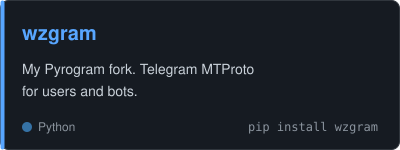
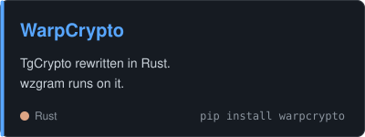
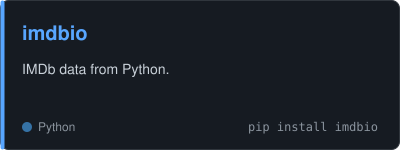
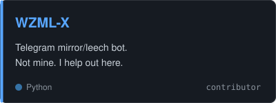

### Hi, I'm Riajul.

I build fast Telegram tooling in Python and Rust. Right now I'm working on [wzgram](https://github.com/rjriajul/wzgram), a modern Pyrogram fork, and [WarpCrypto](https://github.com/rjriajul/WarpCrypto), the Rust crypto core it runs on.

[rj1.dev](https://rj1.dev/) · [rj@rj1.dev](mailto:rj@rj1.dev)

## What I'm building

<table>
  <tr>
    <td>  </td>
    <td>  </td>
  </tr>
  <tr>
    <td>  </td>
    <td>  </td>
  </tr>
</table>

## Tools

<table>
  <tr><td><b>Languages</b></td><td></td></tr>
  <tr><td><b>DevOps</b></td><td></td></tr>
  <tr><td><b>Cloud</b></td><td></td></tr>
</table>

…and whatever the next project needs.

## Latest from my blog

- [A Goodbye Post, a Friend, and Our Own Telegram Library](https://rj1.dev/blog/from-a-goodbye-post-to-the-fastest-telegram-library/)
- [Hello World!](https://rj1.dev/blog/hello-world/)

